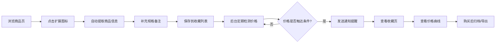

## 1. 产品概述

为网购用户设计的智能价格追踪与比价提醒浏览器扩展，解决跨平台比价繁琐、降价错过、价格波动难以察觉等痛点。用户可一键收藏商品、追踪历史价格、设置多维提醒，实现理性省钱购物。

- 核心价值：自动记录价格波动、降价及时提醒、比价一目了然
- 目标用户：经常在淘宝/京东/拼多多/天猫等平台购物的用户

## 2. 核心功能

### 2.2 功能模块

1. **弹出面板**：一键保存商品、快速录入商品信息、规格备注、查看统计摘要
2. **商品收藏页**：商品列表展示、多维筛选（平台/品类/降价幅度/购买计划）、商品管理操作
3. **价格曲线页**：历史价格走势图表、最低价标记、七日趋势、异常涨价标记
4. **提醒设置页**：目标价提醒、优惠券提示、补货通知、重复商品合并、已购归档、购物清单导出

### 2.3 页面详情

| 页面名称 | 模块名称 | 功能描述 |
|---------|---------|---------|
| 弹出面板 | 商品信息提取 | 自动从当前页面提取名称/规格/价格/店铺/链接 |
| 弹出面板 | 手动录入编辑 | 支持用户修改补充信息、添加规格备注 |
| 弹出面板 | 快捷操作 | 一键保存、跳转收藏页、查看今日统计 |
| 收藏页 | 筛选栏 | 平台筛选、品类筛选、降价幅度、购买计划状态 |
| 收藏页 | 商品卡片 | 缩略图、名称、当前价、最低价、降价幅度、快捷操作 |
| 收藏页 | 批量操作 | 批量删除、批量归档、批量导出 |
| 价格曲线页 | 价格图表 | SVG/Canvas 绘制的历史价格折线图 |
| 价格曲线页 | 数据标记 | 最低价圆点、异常涨价高亮、近七日趋势线 |
| 价格曲线页 | 统计面板 | 历史最低价、平均价、最高涨幅、最大降幅 |
| 提醒设置页 | 目标价设置 | 为每个商品设置期望购入价 |
| 提醒设置页 | 通知类型 | 降价提醒、优惠券、补货、到价提醒 |
| 提醒设置页 | 商品管理 | 重复合并、归档、导出购物清单 |

## 3. 核心流程

用户在电商平台浏览商品 → 点击扩展图标打开弹出面板 → 自动提取商品信息 → 用户补充规格备注后保存 → 扩展后台定期检查价格变动 → 价格触发提醒条件时弹出通知 → 用户在收藏页筛选查看 → 点击商品查看详细价格曲线 → 购买后归档或导出清单。

## 4. 用户界面设计

### 4.1 设计风格
- **主色调**：深青绿渐变 `#0d9488` → `#0891b2`（传达省钱、智慧、清爽的品牌感）
- **辅助色**：降价绿 `#10b981`、涨价红 `#ef4444`、提醒橙 `#f59e0b`
- **背景**：浅灰 `#f8fafc` + 微妙噪点纹理，卡片纯白配柔和投影
- **按钮风格**：圆润胶囊形（圆角 12px），悬停时轻微上浮 + 发光阴影
- **字体**：系统无衬线字体，标题加粗，数字等宽显示
- **布局**：卡片式栅格布局，信息分区清晰，留白充足
- **图标风格**：线性 SVG 图标，搭配彩色角标表示状态

### 4.2 页面设计概览

| 页面名称 | 模块名称 | UI 元素 |
|---------|---------|---------|
| 弹出面板 | 顶部导航 | 渐变图标、保存按钮、页面跳转图标 |
| 弹出面板 | 表单区 | 带图标的输入框、规格标签（可删除）、文本域备注 |
| 弹出面板 | 底部统计 | 今日新增、降价数量、平均降幅的彩色数据块 |
| 收藏页 | 筛选栏 | 下拉筛选器 + 标签切换 + 搜索框，悬浮吸顶 |
| 收藏页 | 商品网格 | 响应式卡片，悬停显示操作按钮，降价幅度彩色徽章 |
| 收藏页 | 批量栏 | 底部浮层，显示选中数量和批量操作 |
| 价格曲线页 | 图表区 | 深色背景图表网格，渐变折线填充，数据点悬浮提示 |
| 价格曲线页 | 统计卡 | 四色数据卡片横向排列，数字带动效 |
| 价格曲线页 | 图例 | 最低价/异常点/七日趋势的颜色图例 |
| 提醒设置页 | 设置卡 | 分组标题 + 开关/滑块/输入，滑动过渡动画 |
| 提醒设置页 | 商品操作 | 可拖拽合并，归档动画（淡出右滑），导出按钮 |

### 4.3 响应式
- 弹出面板：固定宽度 380px，适配浏览器扩展标准
- 收藏页/曲线页/设置页：桌面端全屏使用，侧边栏导航，1200px 以上双栏，1200px 以下单栏
- 触控优化：最小点击区域 44px，列表项 56px 高度
