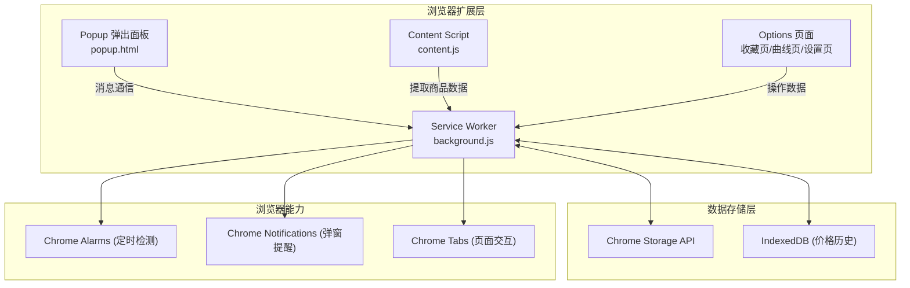
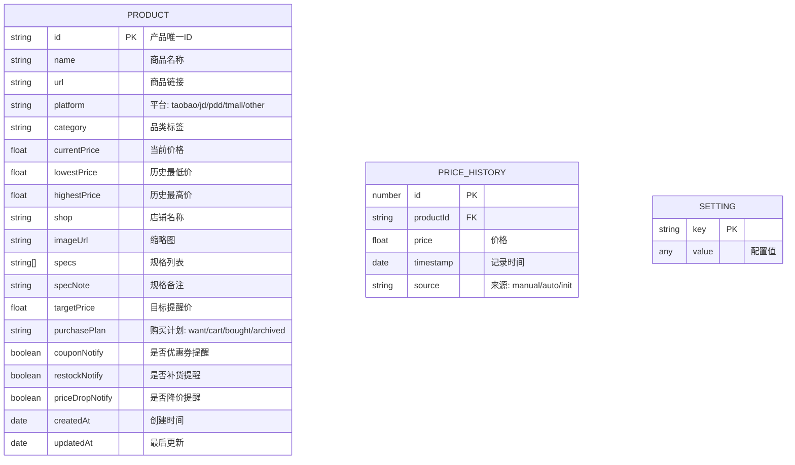

## 1. 架构设计



## 2. 技术说明

- **扩展规范**：Chrome Extension Manifest V3
- **前端框架**：原生 HTML5 + CSS3 + ES6+ JavaScript（零依赖，轻量高效）
- **图表绘制**：原生 Canvas 2D API 实现价格曲线图（不引入 Chart.js 等外部库）
- **数据存储**：
  - 商品元数据：`chrome.storage.local`（容量上限 ~5MB，足够存储数千商品）
  - 价格历史记录：IndexedDB（支持大量时间序列数据）
- **定时检测**：`chrome.alarms` API，每 6 小时触发一次价格刷新
- **消息通信**：`chrome.runtime.sendMessage` 实现 popup/content/background 通信
- **打包方式**：纯静态文件，无需构建工具，可直接加载解压扩展

## 3. 路由与页面定义

| 页面 | 文件路径 | 用途 |
|------|---------|------|
| 弹出面板 | `/popup/popup.html` | 点击扩展图标打开的快捷操作面板 |
| 商品收藏页 | `/pages/favorites.html` | 全功能商品收藏列表与筛选 |
| 价格曲线页 | `/pages/chart.html?productId=xxx` | 单商品历史价格走势分析 |
| 提醒设置页 | `/pages/settings.html` | 全局提醒配置与商品管理操作 |
| 背景脚本 | `/background/background.js` | Service Worker，处理定时任务与通知 |
| 内容脚本 | `/content/content.js` | 注入电商页面，自动提取商品信息 |

## 4. 数据模型

### 4.1 数据模型定义



### 4.2 Storage Key 定义

```javascript
// 商品索引列表存储于 chrome.storage.local
key: 'products', value: [Product对象数组]

// 全局设置
key: 'settings', value: {
  checkIntervalHours: 6,       // 价格检查间隔（小时）
  priceDropThreshold: 5,       // 降幅提醒阈值（百分比）
  priceSpikeThreshold: 15,     // 异常涨价阈值（百分比）
  exportFormat: 'csv',         // 导出格式 csv/json
  mergeStrategy: 'url-base'    // 重复合并策略
}
```

### 4.3 IndexedDB Schema

```javascript
// 数据库: priceTrackerDB
// Object Store: priceHistory
// 索引: 
//   - productId (按产品查询)
//   - timestamp (按时间排序)
// 单条记录: { productId, price, timestamp, source }
```

## 5. 核心模块说明

| 模块 | 文件 | 职责 |
|------|------|------|
| 数据层 | `/background/storage.js` | 封装 chrome.storage 与 IndexedDB 操作 |
| 消息总线 | `/background/messaging.js` | 统一处理各页面/脚本的消息路由 |
| 价格检测 | `/background/priceChecker.js` | 定时抓取价格、计算波动、触发提醒 |
| 通知系统 | `/background/notifier.js` | 构建并展示 Chrome 通知 |
| 数据抓取 | `/content/extractors/` | 各电商平台 DOM 选择器适配层 |
| 图表引擎 | `/pages/lib/chart.js` | Canvas 绘制折线图、标记点、趋势线 |
| 导出工具 | `/pages/lib/exporter.js` | CSV/JSON 格式购物清单导出 |
| UI 组件 | `/pages/lib/ui.js` | 通用组件（筛选器、卡片、弹窗等） |
